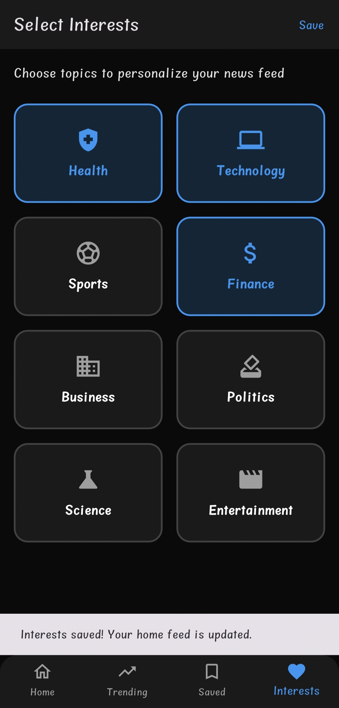

# News App (Flutter) 📰

A news aggregator app built with Flutter that displays articles from various sources, allowing users to filter by category, search for topics, and personalize their feed. This project was completed as part of the Android Development Internship at Cantilever.

---

## Features

- **Live News Feed**: Fetches and displays the latest news articles from the NewsAPI.
- **Infinite Scrolling**: New articles are loaded automatically as the user scrolls to the bottom of the list.
- **Category Filtering**: Users can browse news from different categories like Business, Technology, Sports, and more.
- **Search Functionality**: A robust search bar allows users to find articles on any topic.
- **Personalized Interests**: Users can select their favorite topics to create a customized news feed on the home screen.
- **Save Articles**: Bookmark articles to read later, which are stored locally on the device.
- **Dark Mode UI**: A sleek and modern user interface designed for a dark theme.

---

## Tech Stack

- **Framework**: Flutter
- **Language**: Dart
- **API**: [NewsAPI.org](https://newsapi.org/)
- **State Management**: Singleton pattern for simple global state.
- **Async Operations**: `Future` and `async/await`.
- **Packages**:
  - `http`: For making API requests.
  - `cached_network_image`: To efficiently load and cache images.
  - `url_launcher`: To open original articles in a web browser.
  - `shared_preferences`: For saving articles and user interests locally.

---

## Screenshots

| Home Screen | Search Results |
| :---: | :---: |
|  |  |

| Categories | Trending News |
| :---: | :---: |
|  |  |

| Saved Articles | Select Interests |
| :---: | :---: |
|  |  |